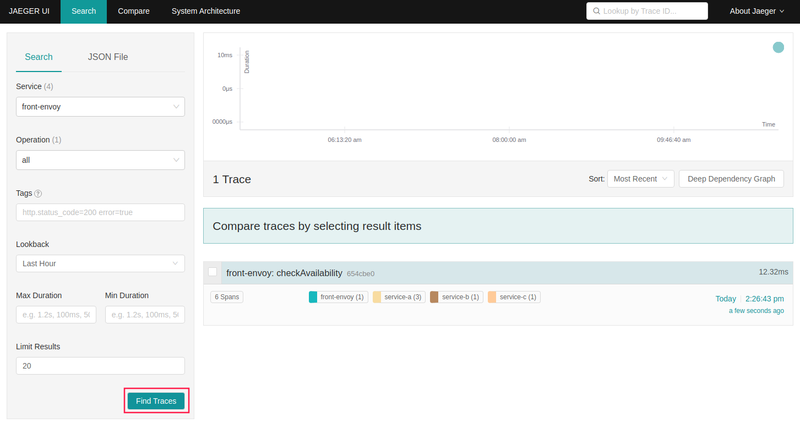
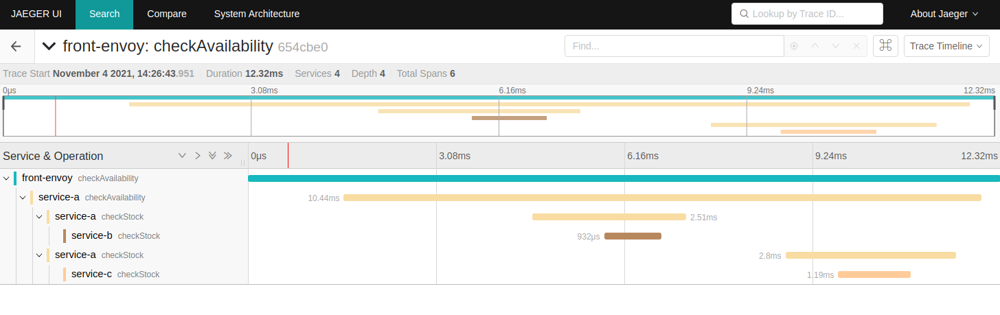
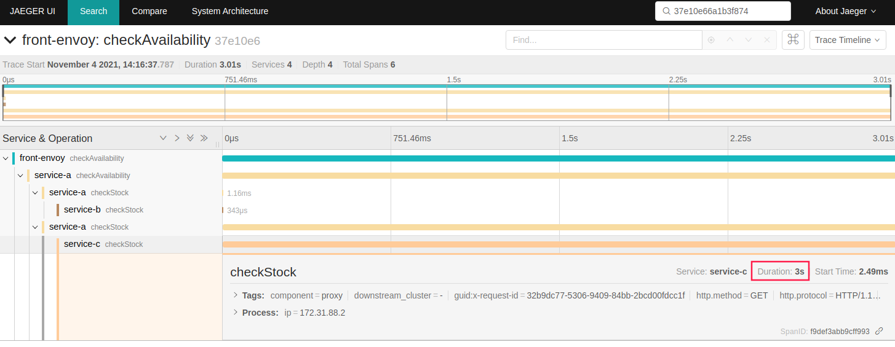

## 使用Jaeger追踪Envoy Mesh 
### 架构示意图


##### Envoy Mesh使用的网络: 172.31.88.0/24

##### 8个Service:

- front-envoy：Front Proxy,地址为172.31.88.10
- 6个后端服务
  - service_a_envoy和service_a：对应于Envoy中的service_a集群，会调用service_b和service_c；
  - service_b_envoy和service_b：对应于Envoy中的service_b集群；
  - service_c_envoy和service_c：对应于Envoy中的service_c集群；
- zipkin：Jaeger all-in-one服务

### 运行并测试

1.  启动服务

   ```
   docker-compose build
   docker-compose up
   ```

2. 访问测试

   向Front-Envoy发起一次请求

   ```
   curl -vv 172.31.88.10
   
   命令会输出类似如下响应结果：
   *   Trying 172.31.88.10:80...
   * TCP_NODELAY set
   * Connected to 172.31.88.10 (172.31.88.10) port 80 (#0)
   > GET / HTTP/1.1
   > Host: 172.31.88.10
   > User-Agent: curl/7.68.0
   > Accept: */*
   > 
   * Mark bundle as not supporting multiuse
   < HTTP/1.1 200 OK
   < date: Thu, 04 Nov 2021 06:26:43 GMT
   < content-length: 85
   < content-type: text/plain; charset=utf-8
   < x-envoy-upstream-service-time: 11
   < server: envoy
   < x-b3-traceid: 654cbe022a34d141
   < x-request-id: d9b1952e-79ba-9130-aa2c-dbe7571af02a
   < 
   Calling Service B: Hello from service B.
   Hello from service A.
   Hello from service C.
   * Connection #0 to host 172.31.88.10 left intact
   ```

   Jaeger会记录到该请求相关的Trace。访问宿主机的16686端口，即可通过浏览器访问Jaeger UI。

   

   我们可以通过Trace树了解相关的追踪信息。

   

   以及每个Span的详细信息

   

3. abort异常请求问题定位

   示例中，service-b上对10%的流量注入了abort故障，service-c上对10%的流量注入了3秒钟的delay，以模拟请求中的异常。我们可以反复向front-envoy发起请求，收到类似如下响应时，即根据其traceid在Zipkin中搜索。

   ```
   curl -vv 172.31.85.10
   
   # 以下响应内容中，fault filter abort，表示service-a调用service-b遇到了abort故障；
   *   Trying 172.31.88.10:80...
   * TCP_NODELAY set
   * Connected to 172.31.88.10 (172.31.88.10) port 80 (#0)
   > GET / HTTP/1.1
   > Host: 172.31.88.10
   > User-Agent: curl/7.68.0
   > Accept: */*
   > 
   * Mark bundle as not supporting multiuse
   < HTTP/1.1 200 OK
   < date: Thu, 04 Nov 2021 06:11:12 GMT
   < content-length: 81
   < content-type: text/plain; charset=utf-8
   < x-envoy-upstream-service-time: 36
   < server: envoy
   < x-b3-traceid: c038f72b3ebadf05
   < x-request-id: 3201dd26-d533-9729-a79d-c23043f44af6
   < 
   Calling Service B: fault filter abortHello from service A.
   Hello from service C.
   * Connection #0 to host 172.31.88.10 left intact
   ```

   根据上面响应内容中的标头x-b3-traceid中的traceid即可到Zipkin中进行定向搜索；

   

4. delay异常请求问题定位

   ```
   curl -vv 172.31.85.10
   
   # 如下响应内容中的x-envoy-upstream-service-time标头的3005毫秒的响应时长，
   # 便是由我们注入的故障引起
   *   Trying 172.31.88.10:80...
   * TCP_NODELAY set
   * Connected to 172.31.88.10 (172.31.88.10) port 80 (#0)
   > GET / HTTP/1.1
   > Host: 172.31.88.10
   > User-Agent: curl/7.68.0
   > Accept: */*
   > 
   * Mark bundle as not supporting multiuse
   < HTTP/1.1 200 OK
   < date: Thu, 04 Nov 2021 06:16:40 GMT
   < content-length: 85
   < content-type: text/plain; charset=utf-8
   < x-envoy-upstream-service-time: 3005
   < server: envoy
   < x-b3-traceid: 37e10e66a1b3f874
   < x-request-id: 32b9dc77-5306-9409-84bb-2bcd00fdcc1f
   < 
   Calling Service B: Hello from service B.
   Hello from service A.
   Hello from service C.
   * Connection #0 to host 172.31.88.10 left intact
   ```

   根据上面响应内容中的标头x-b3-traceid中的traceid即可到Zipkin中进行定向搜索；

   

5. 停止后清理

```
docker-compose down
```

## 版权声明

本文档版本归[马哥教育](www.magedu.com)所有，未经允许，不得随意转载和商用。
