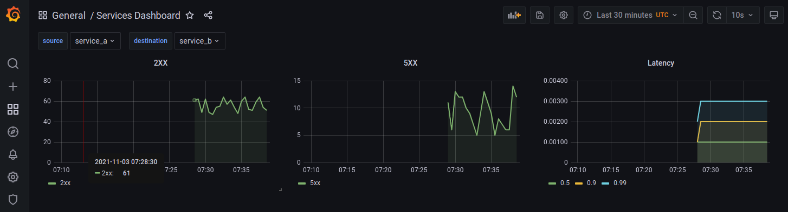
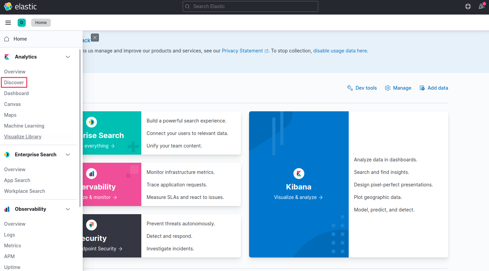
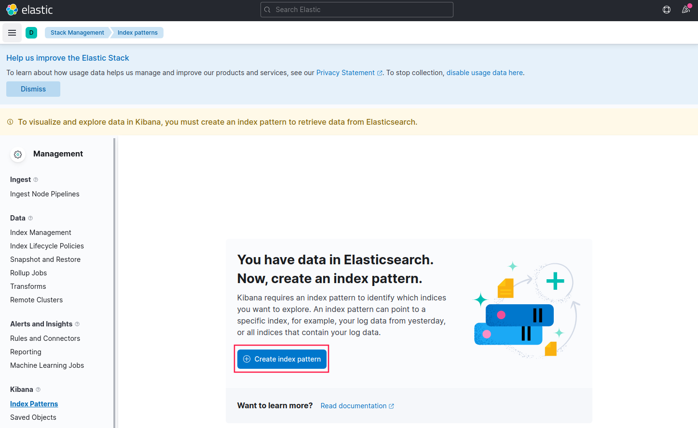
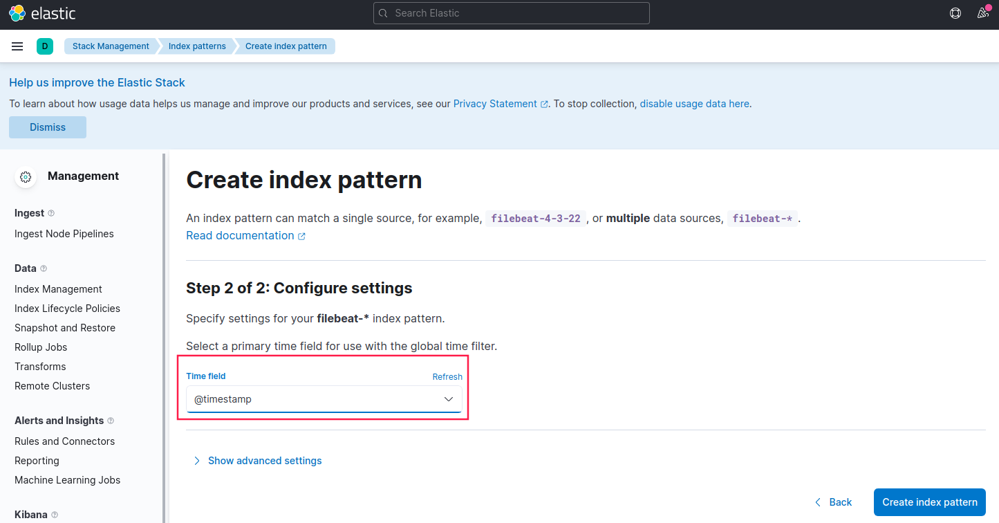
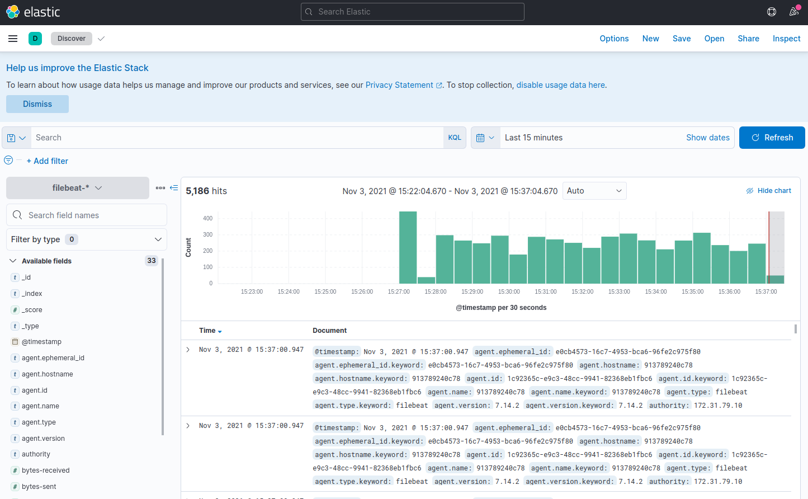

## 使用Prometheus和Grafana监控Envoy Mesh 
### 架构示意图


##### Envoy Mesh使用的网络: 172.31.79.0/24

##### 10个Service:

- front-envoy：Front Proxy,地址为172.31.79.10
- 6个后端服务
  - service_a_envoy和service_a：对应于Envoy中的service_a集群，会调用service_b和service_c；
  - service_b_envoy和service_b：对应于Envoy中的service_b集群；
  - service_c_envoy和service_c：对应于Envoy中的service_c集群；
- Prometheus指标监控相关的服务3个
  - statsd_exporter
  - prometheus
  - grafana
- EFK日志相关的服务3个
  - elaistchsearch
  - kibana
  - filebeat

##### 特殊要求

目录logs/envoy/下的日志文件front-envoy-access.log的属主需要修改为envoy容器中运行envoy进程的用户envoy，其UID和GID默认分别为100和101，否则，front-envoy进程将日志写入到该文件时，将显示为“Permission Denied.”

```
chown 100.101 logs/envoy/front-envoy-access.log
```

### 运行并测试

1.  启动服务

   ```
   docker-compose build
   docker-compose up
   ```

2. 访问测试

   向Front-Envoy发起请求，下面的命令模拟间隔1秒之内的随机时长进行请求；

   ```
   while true; do curl 172.31.79.10; sleep 0.$RANDOM; done
   
   命令会输出类似如下响应结果：
   Calling Service B: Hello from service B.
   Hello from service A.
   Hello from service C.
   Calling Service B: Hello from service B.
   Hello from service A.
   Hello from service C.
   Calling Service B: fault filter abortHello from service A.
   Hello from service C.
   Calling Service B: Hello from service B.
   Hello from service A.
   Hello from service C.
   Calling Service B: Hello from service B.
   Hello from service A.
   Hello from service C.
   ……
   ```

3. 查看Prometheus

   访问宿主机的9090端口即可打开Prometheus的表达式浏览器；

   

4. 查看Grafana

   访问宿主机的3000端口，即可打开Grafana的控制台界面

   

5.  确认ElasticSearch服务正常工作，且Filebeat已经输出日志信息到指定的索引中

    ```
    curl 172.31.79.15:9200
    # 正常运行的ElasticSearch将返回类似如下内容
    {
      "name" : "myes01",
      "cluster_name" : "myes",
      "cluster_uuid" : "QSAkdrV-QziRgGuZUgbCyg",
      "version" : {
        "number" : "7.14.2",
        "build_flavor" : "default",
        "build_type" : "docker",
        "build_hash" : "6bc13727ce758c0e943c3c21653b3da82f627f75",
        "build_date" : "2021-09-15T10:18:09.722761972Z",
        "build_snapshot" : false,
        "lucene_version" : "8.9.0",
        "minimum_wire_compatibility_version" : "6.8.0",
        "minimum_index_compatibility_version" : "6.0.0-beta1"
      },
      "tagline" : "You Know, for Search"
    }
    ```

    查看是否已经存在由filebeat生成的索引；

    ```
    curl 172.31.79.15:9200/_cat/indices
    # 命令返回的索引中包含类似如下内容，即表示filebeat已经生成相应的索引
    ……
    yellow open filebeat-2021.11.03               VTqwVr_8RD2k8aGal-YCHg 1 1 44   0 80.6kb 80.6kb
    ……
    ```

    

4. 访问Kibana

   在宿主机可以访问Kibana，端口为5601

   

   第二步：

   

   第三步：

   

   第四步：

   

   

   第五步：再次访问Discover，即可看到由filebeat收集的envoy的日志

   

5.  进一步操作

    可以将EFK的各组件均纳入Prometheus监控系统中，也应该将Prometheus和Grafana的日志也收集到EFK之中。
    
8. 停止后清理

```
docker-compose down
docker volume rm new_elasticsearch_data
```

## 版权声明

本文档版本归[马哥教育](www.magedu.com)所有，未经允许，不得随意转载和商用。
