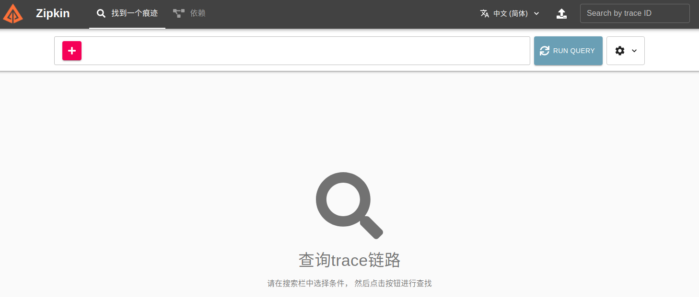
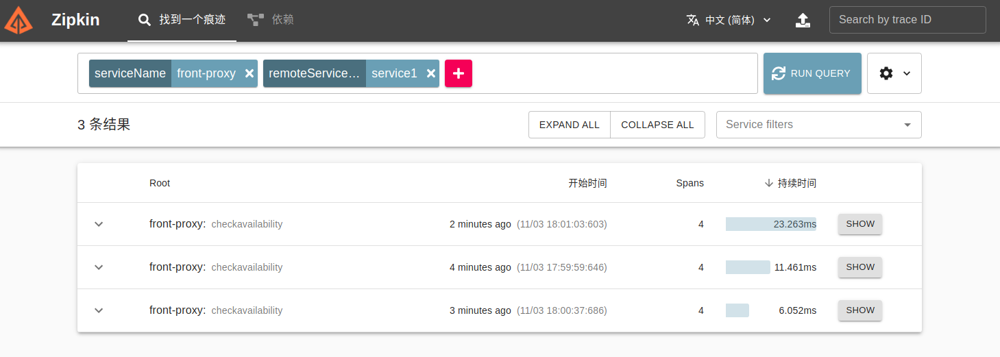
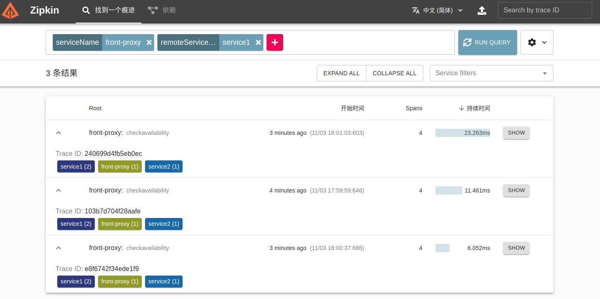
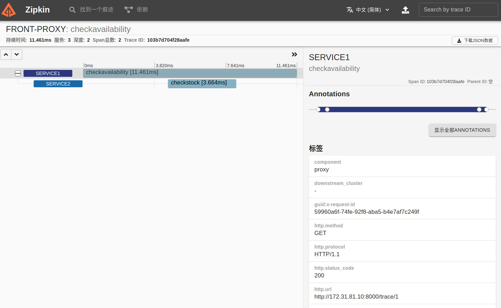

# 使用Zipkin在Envoy中进行连接追踪

### 系统环境

##### 网络：172.31.81.0/24

##### 服务：

- Front-Proxy：前端代理，监听端口8000/tcp
- 2个后端服务
  - service1：接收Front-Envoy的请求，并会请求service2
  - service2：接收service1的请求
- 追踪服务zipkin，监听端口9411

### 运行

1. 启动服务

   ```
   docker-compose build
   docker-compose up
   ```

2. 请求代理服务

   ```
   curl -v 172.31.81.10:8000/trace/1
   
   # 该命令会收到类似如下响应
   *   Trying 172.31.81.10:8000...
   * TCP_NODELAY set
   * Connected to 172.31.81.10 (172.31.81.10) port 8000 (#0)
   > GET /trace/1 HTTP/1.1
   > Host: 172.31.81.10:8000
   > User-Agent: curl/7.68.0
   > Accept: */*
   > 
   * Mark bundle as not supporting multiuse
   < HTTP/1.1 200 OK
   < content-type: text/html; charset=utf-8
   < content-length: 90
   < server: envoy
   < date: Wed, 03 Nov 2021 09:59:59 GMT
   < x-envoy-upstream-service-time: 11
   < x-b3-traceid: 103b7d704f28aafe
   < x-request-id: 59960a6f-74fe-92f8-aba5-b4e7af7c249f
   < 
   Hello from behind Envoy (service 1)! hostname: 7ec5c840997d resolvedhostname: 172.31.81.2
   
   # 可多次反复发起请求，以便于后面在UI中了解追踪的结果。
   ```

3. 通过UI访问Zipkin

   Zipkin默认监听在TCP协议的9411端口，通过http提供服务

   

   键入查询条件，即可过滤产出的追踪信息

   

   简要追踪信息

   

   详细的追踪信息

   

4. 清理

```
docker-compose down
```

## 版权声明

本文档版本归[马哥教育](www.magedu.com)所有，未经允许，不得随意转载和商用。