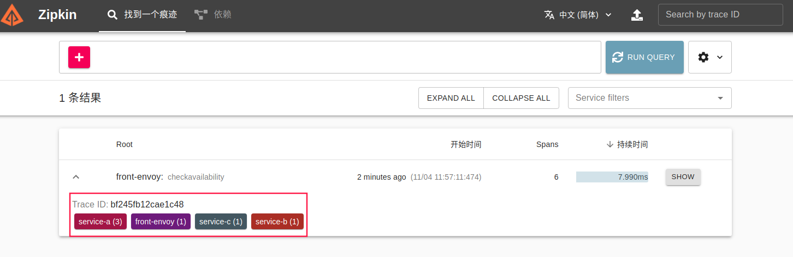
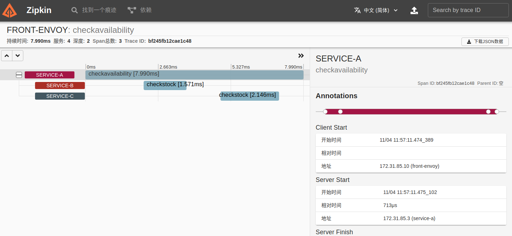
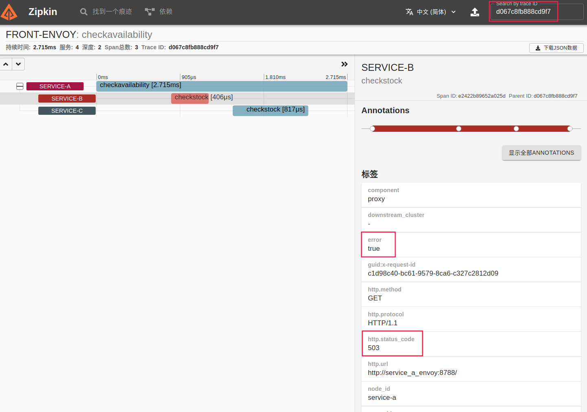
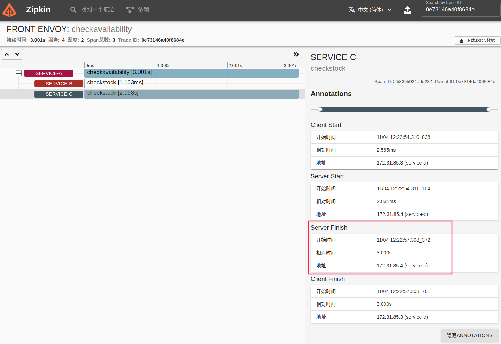

## 使用Zipkin追踪Envoy Mesh 
### 架构示意图


##### Envoy Mesh使用的网络: 172.31.85.0/24

##### 8个Service:

- front-envoy：Front Proxy,地址为172.31.85.10
- 6个后端服务
  - service_a_envoy和service_a：对应于Envoy中的service_a集群，会调用service_b和service_c；
  - service_b_envoy和service_b：对应于Envoy中的service_b集群；
  - service_c_envoy和service_c：对应于Envoy中的service_c集群；
- zipkin：Zipkin服务

### 运行并测试

1.  启动服务

   ```
   docker-compose build
   docker-compose up
   ```

2. 访问测试

   向Front-Envoy发起请求，下面的命令模拟间隔1秒之内的随机时长进行请求；

   ```
   curl -vv 172.31.85.10
   
   命令会输出类似如下响应结果：
   
   *   Trying 172.31.85.10:80...
   * TCP_NODELAY set
   * Connected to 172.31.85.10 (172.31.85.10) port 80 (#0)
   > GET / HTTP/1.1
   > Host: 172.31.85.10
   > User-Agent: curl/7.68.0
   > Accept: */*
   > 
   * Mark bundle as not supporting multiuse
   < HTTP/1.1 200 OK
   < date: Thu, 04 Nov 2021 03:57:11 GMT
   < content-length: 85
   < content-type: text/plain; charset=utf-8
   < x-envoy-upstream-service-time: 7
   < server: envoy
   < x-b3-traceid: bf245fb12cae1c48
   < x-request-id: 47f24fc7-fb78-9024-bb9b-39a9cbf21bbb
   < 
   Calling Service B: Hello from service B.
   Hello from service A.
   Hello from service C.
   * Connection #0 to host 172.31.85.10 left intact
   ```

   ZipKin会记录到该请求相关的Trace。

   

   我们可以通过Trace树了解相关的追踪信息。

   

3. abort异常请求问题定位

   示例中，service-b上对10%的流量注入了abort故障，service-c上对10%的流量注入了3秒钟的delay，以模拟请求中的异常。我们可以反复向front-envoy发起请求，收到类似如下响应时，即根据其traceid在Zipkin中搜索。

   ```
   curl -vv 172.31.85.10
   
   # 以下响应内容中，fault filter abort，表示service-a调用service-b遇到了abort故障；
   *   Trying 172.31.85.10:80...
   * TCP_NODELAY set
   * Connected to 172.31.85.10 (172.31.85.10) port 80 (#0)
   > GET / HTTP/1.1
   > Host: 172.31.85.10
   > User-Agent: curl/7.68.0
   > Accept: */*
   > 
   * Mark bundle as not supporting multiuse
   < HTTP/1.1 200 OK
   < date: Thu, 04 Nov 2021 04:14:23 GMT
   < content-length: 81
   < content-type: text/plain; charset=utf-8
   < x-envoy-upstream-service-time: 2
   < server: envoy
   < x-b3-traceid: d067c8fb888cd9f7
   < x-request-id: c1d98c40-bc61-9579-8ca6-c327c2812d09
   < 
   Calling Service B: fault filter abortHello from service A.
   Hello from service C.
   * Connection #0 to host 172.31.85.10 left intact
   ```

   根据上面响应内容中的标头x-b3-traceid中的traceid即可到Zipkin中进行定向搜索；

   

4. delay异常请求问题定位

   ```
   curl -vv 172.31.85.10
   
   # 如下响应内容中的x-envoy-upstream-service-time标头的3000毫秒的响应时长，
   # 便是由我们注入的故障引起
   *   Trying 172.31.85.10:80...
   * TCP_NODELAY set
   * Connected to 172.31.85.10 (172.31.85.10) port 80 (#0)
   > GET / HTTP/1.1
   > Host: 172.31.85.10
   > User-Agent: curl/7.68.0
   > Accept: */*
   > 
   * Mark bundle as not supporting multiuse
   < HTTP/1.1 200 OK
   < date: Thu, 04 Nov 2021 04:22:57 GMT
   < content-length: 85
   < content-type: text/plain; charset=utf-8
   < x-envoy-upstream-service-time: 3000       # 此处的响应时长，表示上游服务持续了3000毫秒
   < server: envoy
   < x-b3-traceid: 0e73146a40f8684e
   < x-request-id: 1898cef9-beb3-94fa-bc88-eeb80a0ca151
   < 
   Calling Service B: Hello from service B.
   Hello from service A.
   Hello from service C.
   * Connection #0 to host 172.31.85.10 left intact
   ```

   根据上面响应内容中的标头x-b3-traceid中的traceid即可到Zipkin中进行定向搜索；

   

5. 停止后清理

```
docker-compose down
```

## 版权声明

本文档版本归[马哥教育](www.magedu.com)所有，未经允许，不得随意转载和商用。
