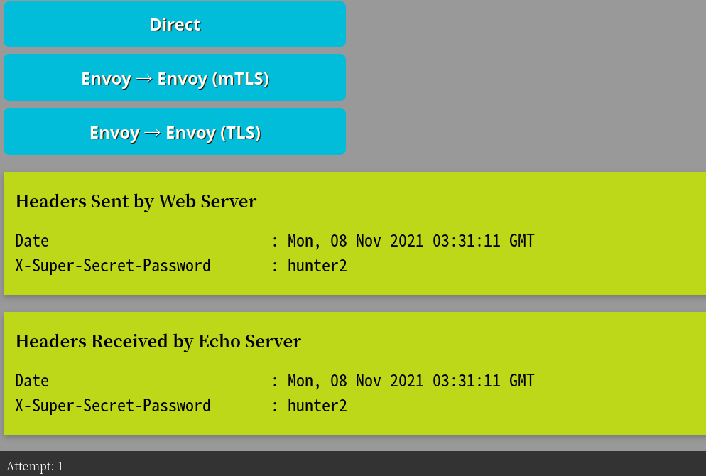
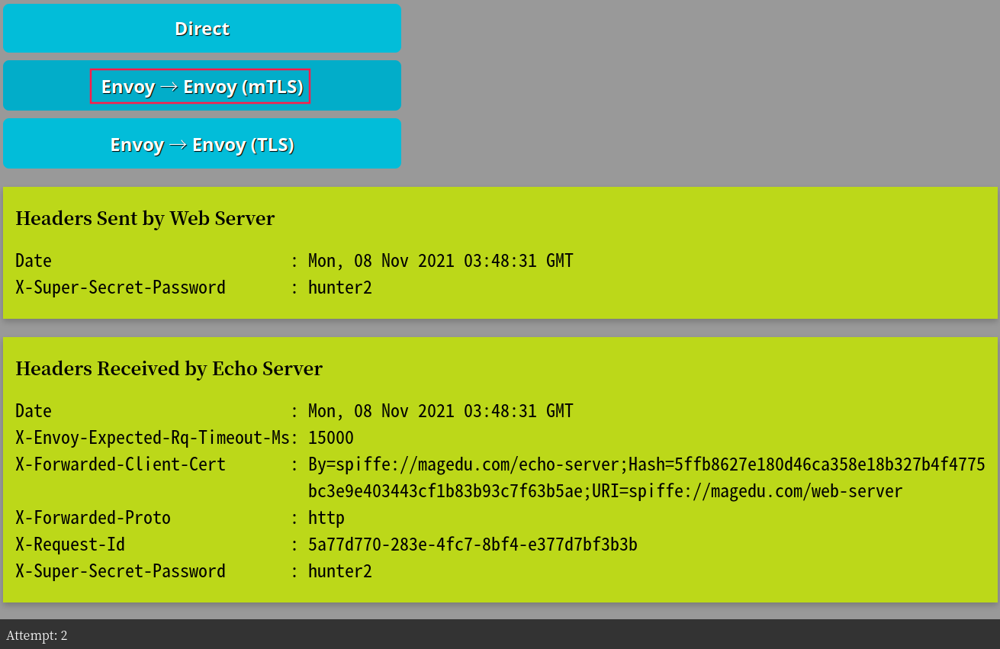
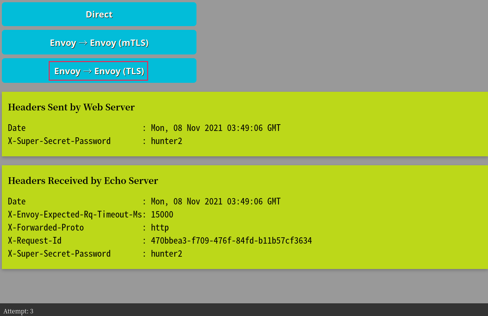

# 基于SPIRE 1.0.1的Envoy 1.20.0 SDS示例

## 依赖条件

- Go 1.14
- docker-compose

## 环境说明

##### Envoy Mesh使用的网络: 172.31.92.0/24

##### 3个Service:

- web-server：ip地址172.31.92.5
- echo-server：ip地址172.31.92.6
- spire-server：ip地址172.31.92.7

## Build

运行脚本，构建echo-server和web-server等

```
$ ./build.sh
```

## Run

启动服务

```
$ docker-compose up -d
```

## Start Web and Echo Servers

```
$ ./1-start-services.sh
```

## Start SPIRE Agents 

```
$ ./2-start-spire-agents.sh
```

## Create Workload Registration Entries

```
$ ./3-create-registration-entries.sh
```

## 通过访问Web Server进行测试

访问宿主机的8080/tcp端口，即可访问到Web Server的UI，它提供了三个不同的测试链接：

- Web Server和Echo Server间的直接通信

  

- Web Server和Echo Server基于Envoy进行的mTLS通信

  

- Web和Echo Server之间基于Envoy进行的tls通信

  

**NOTE** It may take a 30 seconds or so for Envoy to reconnect to upstream
after the registration entries are created.

## 查看Web和Echo Server的证书

#### web server的证书

从下面的命令结果中，可以看出，CA为spiffe://magedu.com，颁发给web server的证书，其subject为spiffe://magedu.com/web-server，有效期限为1天。

```
$ curl  172.31.92.5:9901/certs
# 以下为命令的执行结果
{
 "certificates": [
  {
   "ca_cert": [
    {
     "path": "magedu.com: \u003cinline\u003e",
     "serial_number": "0",
     "subject_alt_names": [
      {
       "uri": "spiffe://magedu.com"
      }
     ],
     "days_until_expiration": "0",
     "valid_from": "2021-11-08T03:46:57Z",
     "expiration_time": "2021-11-09T03:47:07Z"
    }
   ],
   "cert_chain": []
  },
  {
   "ca_cert": [
    {
     "path": "magedu.com: \u003cinline\u003e",
     "serial_number": "0",
     "subject_alt_names": [
      {
       "uri": "spiffe://magedu.com"
      }
     ],
     "days_until_expiration": "0",
     "valid_from": "2021-11-08T03:46:57Z",
     "expiration_time": "2021-11-09T03:47:07Z"
    }
   ],
   "cert_chain": [
    {
     "path": "\u003cinline\u003e",
     "serial_number": "a3dc15ccfcf4a934ea0945fa2832a79a",
     "subject_alt_names": [
      {
       "uri": "spiffe://magedu.com/web-server"
      }
     ],
     "days_until_expiration": "0",
     "valid_from": "2021-11-08T03:47:50Z",
     "expiration_time": "2021-11-08T04:48:00Z"
    }
   ]
  }
 ]
}
```

#### echo server的证书

从下面的命令结果中，可以看出，CA为spiffe://magedu.com，颁发给web server的证书，其subject为spiffe://magedu.com/echo-server，有效期限为1天。

```
$ curl  172.31.92.6:9901/certs 
# 以下为命令的执行结果
{
 "certificates": [
  {
   "ca_cert": [
    {
     "path": "magedu.com: \u003cinline\u003e",
     "serial_number": "0",
     "subject_alt_names": [
      {
       "uri": "spiffe://magedu.com"
      }
     ],
     "days_until_expiration": "0",
     "valid_from": "2021-11-08T03:46:57Z",
     "expiration_time": "2021-11-09T03:47:07Z"
    }
   ],
   "cert_chain": [
    {
     "path": "\u003cinline\u003e",
     "serial_number": "0b0a79907bebe65cc94560070a0e8dcd",
     "subject_alt_names": [
      {
       "uri": "spiffe://magedu.com/echo-server"
      }
     ],
     "days_until_expiration": "0",
     "valid_from": "2021-11-08T03:47:51Z",
     "expiration_time": "2021-11-08T04:48:01Z"
    }
   ]
  },
  {
   "ca_cert": [],
   "cert_chain": [
    {
     "path": "\u003cinline\u003e",
     "serial_number": "0b0a79907bebe65cc94560070a0e8dcd",
     "subject_alt_names": [
      {
       "uri": "spiffe://magedu.com/echo-server"
      }
     ],
     "days_until_expiration": "0",
     "valid_from": "2021-11-08T03:47:51Z",
     "expiration_time": "2021-11-08T04:48:01Z"
    }
   ]
  }
 ]
}
```


## Clean up

```
$ docker-compose down
```

## Miscellaneous

### Regenerating Agent Certificates for X509PoP attestation

需要重新生成agent证书时，按如下命令运行gencerts.go脚本即可。

```
$ go run gencerts.go web echo
74613bb92549782b5d01ad5e6e93cedd78841683 web
14e6255ca2a1f32198656fc400f82d242ccf44f2 echo
```

This script creates a new CA keypair that is used to sign the service
certificates. It replaces the agent keypairs in the docker
configurations for each service, as well as the agent cacert in the
spire-server configuration.

After running, you must rerun `build.sh` to rebuild the containers with the
changes.