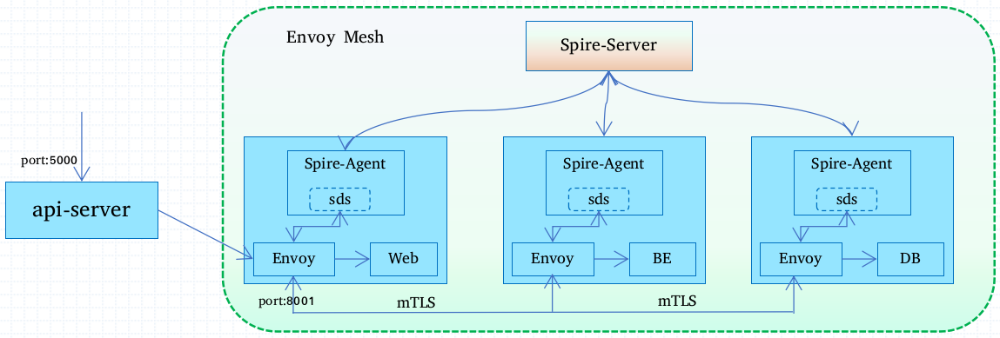

# Envoy Spire SDS

Envoy(v1.11.2) Spire

## Overview

The example consists of three services (`web`, `backend` and `db`) colocated with a running service Envoy. 

The `web` service receives all inbound requests from `api-server-1`. The request is forwarded to the `backend` service which then calls the `db` service.

Secure communication between the `web`, `backend` and `db` service is established by configuring the Envoy proxies in each container to establish a mTLS connection with each other. Envoy retrieves client and server TLS certificates and trusted CA roots for mTLS communication from a SPIRE Agent which implements an Envoy [SDS](https://www.envoyproxy.io/docs/envoy/v1.11.2/configuration/secret#). The agent in-turn fetches this information from the SPIRE Server and makes it available to an identified workload. More information on SPIRE can be found [here](https://spiffe.io/spire/overview/).

- Envoy is listening for ingress on port 8001 in each container.



## Running the Example

### Step 1: Install Docker

Ensure that you have recent versions of `docker` and `docker-compose` installed.

### Step 2: Build

Build the binaries for the `web`, `backend` and `db` service.

```bash
$ ./build.sh
```

### Step 3: Start containers

```bash
$ docker-compose up --build -d

### Step 4: Start SPIRE Infrastructure

Start the SPIRE Agents and register the `web`, `backend` and `db` servers with the SPIRE Server. More information on the registration process can be found [here](https://spiffe.io/spire/overview/#workload-registration).

```bash
$ ./configure-spire.sh
```

### Step 5: Exercise Ingress Policy

Check that `api-server-1` can access the `web` service.

```bash
$ curl -i localhost:5000/hello
HTTP/1.0 200 OK
Content-Type: text/html; charset=utf-8
Content-Length: 29
Server: Werkzeug/0.15.2 Python/2.7.15
Date: Thu, 02 May 2019 21:21:48 GMT

Hello from the web service !
